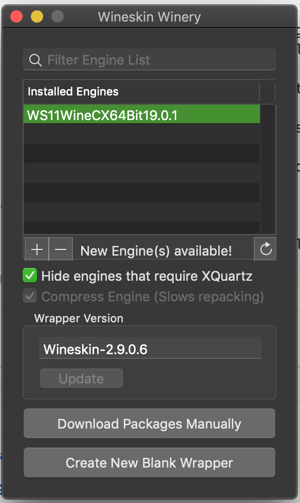

# Clan Lord in Wine on Catalina

## Overview
This is a funny world. It's now easier to run Windows software on Mac than it is to run 32-bit Mac software on a Mac with the Catalina OS installed. Here's some info on how to do this for Clan Lord. 

We will be using the excellent efforts of https://github.com/Gcenx, who has made unofficial builds of Wine which include support for Catalina. 

Updates to the wineskin are released sometimes, so this guide may go out of date. Find the latest Wineskin here:
https://github.com/Gcenx/WineskinServer/releases

## Setup a Wineskin
1. Download Wineskin Winery, which is a package to build macOS style App wrappers around Windows applications: https://github.com/Gcenx/WineskinServer/releases/download/V1.8.4.2/Wineskin.Winery.zip 
1. Open Wineskin winery. It should look a bit like:

1. 1. In the **Wrapper Version** section, click **Update**. As of writing this, it should download 'wineskin-2.9.0.6'
1. 1. Under the **Installed Engines** section, click the **+** button and locate "WS11WineCX64Bit19.0.1". If this is updated it might ...19.0.2 or whatever. That's fine. 
1. 1. This will download a few reasonably large files, and might take a while.

1. Now click **Create New Blank Wrapper**. This generates a macOS Application with everything required for Wine, so it can be quiet big. 
1. 1. Make sure to note where this file/application is created
1. 1. If Wineskin unexpectedly exits or crashes try again. It's a bit buggy. 
1. Open the newly created Wineskin application. You should see this menu pop up:
 

## Install Clan Lord
1. With the Wineskin menu open, we will first install Quicktime.
1. Get the Quicktime installer. A copy that works is here
1. Choose **Install Software**

1. 1. Hit **Choose Setup Executable** and find the quicktime installer you downloaded. 
1. 1. Let that finish installing
1. Locate the Clan Lord Windows install zip file.
1. 1. Unzip it somewhere and note the location. 
1. Get back the **Install Software** menu
1. 1. Hit **Copy A Folder Inside** and choose the Clan Lord Windows folder you unzipped
1. 1. The folder should be copied in, and the Wineskin should figure out that the Clanlord.exe is the main executable. 
1. Close the Wineskin options and application when done. 
1. Now open it again, and Clan Lord should run in Wine. 

## Notes
* The normal Clan Lord updater works, so there's no need to recreate the wrapper once per month. 
* You may need to disable OpenGL inside the Clan Lord preferences. 
* Try and Quit Clan Lord via the menu rather than quiting the Wine Wrapper. 
